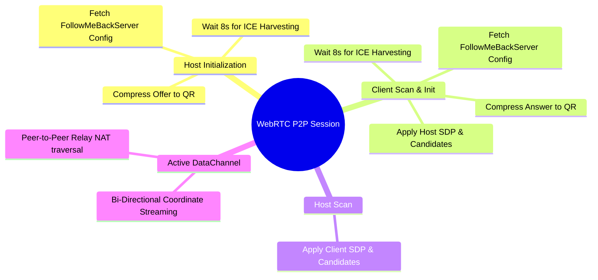
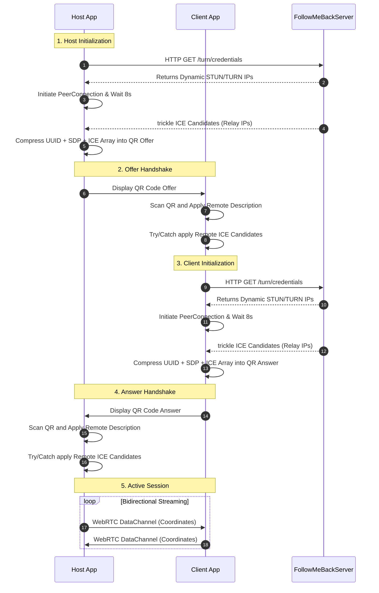

# follow_me_back

This project is a Flutter / Dart project that will help to you as family parent to keep track of your children's location and activities.

## Definition and goals

This app is a family locator that will help you keep track of your children's location and activities. It is a P2P app that will help you keep track of your children's location and activities without being too intrusive or dependent on the OS, unlike the Family Link app.

## Architecture

This application utilizes a **Strict Pure P2P Architecture** powered by WebRTC and explicit ICE candidate harvesting. No proprietary signaling servers or databases are used to relay traffic.

1. **Initial Handshake (QR Codes)**: The Host device initializes a WebRTC Session and waits up to 8 seconds to forcefully harvest all local STUN candidates and external TURN relay IP addresses from the `FollowMeBackServer` (powered by FollowMeBack.io backend). The SDP Offer and the harvested ICE array are compressed into a Static QR Code.
2. **Client Acceptance**: The Client device scans the QR code, applying the Host's explicit candidates. It repeats the harvesting process via the `FollowMeBackServer` and generates a compressed QR Code Answer containing its own explicit STUN/TURN paths, which the Host then scans.
3. **Primary Transport**: Coordinate streaming is performed directly over WebRTC DataChannels (P2P), relying on the `FollowMeBackServer` TURN server relay to punch through restrictive NATs (like 5G/Intranet boundaries).

_Note: Since this is a strict Serverless P2P application, if a device physically changes network hardware (e.g., swapping from Wi-Fi to a 5G Cellular Tower), the sockets are destroyed by the OS. A new QR code must be scanned to establish a new routing path._

### Mindmap Diagram

This mindmap illustrates the initialization and candidate-harvesting process the app uses to seamlessly establish connections.

### Sequence Diagram (The Harvesting Process)

This sequence diagram details exact interactions between the Host, Client, and the FollowMeBackServer TURN server to securely build the static QR code payloads.

